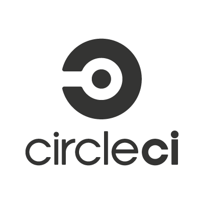
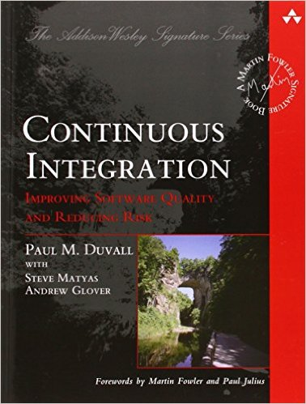

<!-- $theme: default -->

Continuous Integration
===

### “Continuous Integration doesn’t get rid of bugs, but it does make them dramatically easier to find and remove."
<smal>– Martin Fowler<smal>

## What is continuous integration?
Continuous integration (CI) is the process of automatically building and testing your software into a shared repository allowing teams to detect problems early.

[comment]: <> (In the early days of agile, this meant daily builds. But I think that should be run every merge to "integration branch")

## Why we should use continuos integration?
Solve problems quickly to spending more time building features.
* Benefits:
	* No more long and tense integrations.
	* Increase visibility enabling greater communication
	* Catch issues early.
	* Spend less time debugging.
	* Reduce integrations problems allowing to delivery software more rapidly.
	* Reduced Risk.

## Run your tests continuously
Only if the Continuous Integration infrastructure tells you the tests pass, ==**the tests pass!**==

[comment]: <> (Humans make mistakes. Sometimes people consider a change so small it can’t possibly break the app, so they don’t run tests. Then your product goes down and nobody knows why.)

**Any failures can be fixed right away.**

**Nobody has a higher priority task than fixing the build.**

## Practices of Continuous Integration
- Maintain a single Source Repository, put everything you need to build.
- Automate the Build.
- Make Your Build Self-Testing
- Everyone Commits to the mainline at least daily.
- Every commit should build the mainline on an integration machine.
- Fix Broken Builds Immediately.
- Keep the build fast. (10 minutes)
- Everyone can see what's happening.

[comment]: <> (Frequent commits encourage developers to break down their work into small chunks of a few hours each. Keep your use of branches to a minimum In particular have a mainline a single branch of the project currently under development. Reasonable branches are bug fixes of prior production releases and temporary experiments.)

[comment]: <> (build on integration machine Since the developer who commits is responsible for this, that developer needs to monitor the mainline build so they can fix it if it breaks)

[comment]: <> (Keep build fast - The first stage would do the compilation and run tests that are more localized unit tests with the database completely stubbed out. - The second stage build runs a different suite of tests that do hit the real database and involve more end-to-end behavior.)

[comment]: <> (With a good build, I can then think about committing my changes into the repository. The twist, of course, is that other people may, and usually have, made changes to the mainline before I get chance to commit. So first I update my working copy with their changes and rebuild. If their changes clash with my changes, it will manifest as a failure either in the compilation or in the tests. In this case it's my responsibility to fix this and repeat until I can build a working copy that is properly synchronized with the mainline.)

## The Continuous Integration Certification Test

- Your team do continuous integration?
- Your team commits and pushes to a shared mainline at least daily?
- Each such commit causes an automated build and test?
- When the builds fails, it's usually fix it within ten minutes?

[https://www.youtube.com/watch?v=_wnd-eyPoMo]
<smal>by Jez Humble<smal>

## Feature Branch
The basic idea of a feature branch is that when you start work on a feature (or UserStory if you prefer that term) you take a branch of the repository to work on that feature

## Feature Toggle
Feature toggles are a powerful technique, allowing teams to modify system behavior without changing code.

## Branch by Abstraction
A pattern for making large-scale changes to your application incrementally on mainline.

## Feature branch vs Continuos Integration
It's important to note that, most of the time, feature branching like this is a different approach to CI. One of the principles of CI is that everyone commits to the mainline every day.

People say they are doing CI because they are running builds, perhaps using a CI server, on every branch with every commit. That's continuous building, and a Good Thing, but there's no integration, so it's not CI.

#### Continuous Integration

#### Promiscuous Integration

## Tools
 
- [Jenkins](https://jenkins.io/index.html)

 
- [Travis CI](https://travis-ci.org/)

 
- [Go](https://www.gocd.io/)

 
- [Bamboo](https://www.atlassian.com/software/bamboo)

 
- [CircleCI](https://circleci.com/)

 
- [Gitlab CI](https://about.gitlab.com/)

 
- [Codeship](https://codeship.com/)

## Further Reading

<smal>Continuous Integration: Improving Software Quality and Reducing Risk 1st<smal>
<smal>by Paul M. Duvall<smal>

<smal>Continuous Delivery: Reliable Software Releases through Build, Test, and Deployment Automation<smal>
<smal>by Jez Humble and David Farley<small>

### Links
https://martinfowler.com/delivery.html
https://martinfowler.com/bliki/FeatureBranch.html

## Sources
- [https://martinfowler.com/articles/continuousIntegration.html]
- [https://martinfowler.com/bliki/ContinuousIntegrationCertification.html]
- https://www.martinfowler.com/articles/originalContinuousIntegration.html
- [https://www.thoughtworks.com/continuous-integration]
- [http://www.code-maze.com/top-8-continuous-integration-tools/]